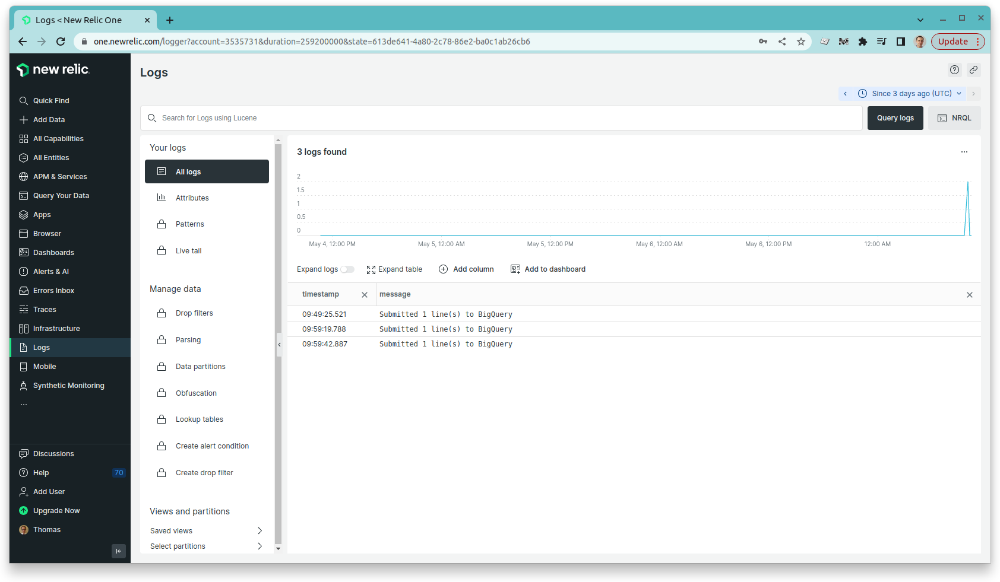

# What Women Want API

## What does this API do?

This API is used for recording campaign responses for What Women Want. Any front end (web, chatbot, Android, Whatsapp, Textit) can connect to this API when a response or responses are received.

This API saves everything in BigQuery so that the dashboards can retrieve the data.

## Where is the URL?

https://www-api-dot-deft-stratum-290216.uc.r.appspot.com/docs

## Continuous integration

This API is built automatically by Github actions.

The Docker container is pushed to Google Container Registry.

Then it is deployed to Google App Engine using a Flex environment (see `app.yaml`).

See [/docs/docs.pdf](/docs/docs.pdf).

# Legacy imports of Excel or imports from Textit

Please run the script in https://github.com/whiteribbonalliance/etl

## Efficiency

Survey responses data is submitted to BigQuery in batches bu the background thread each N seconds.

## Monitoring

The API is monitored using NewRelic. On every batch insertion, number of rows is logged to NewRelic. 

If an operation fails, survey objects that did not make it to BigQuery are recorded as additional attributes of respective log entries, so that they don't get lost.

The Newrelic logs can be found at https://one.newrelic.com/logger?account=3535731 . Account ID is 3535731.

For access to the logs, please contact Thomas Wood at thomas@fastdatascience.com

Screenshot of the logging

